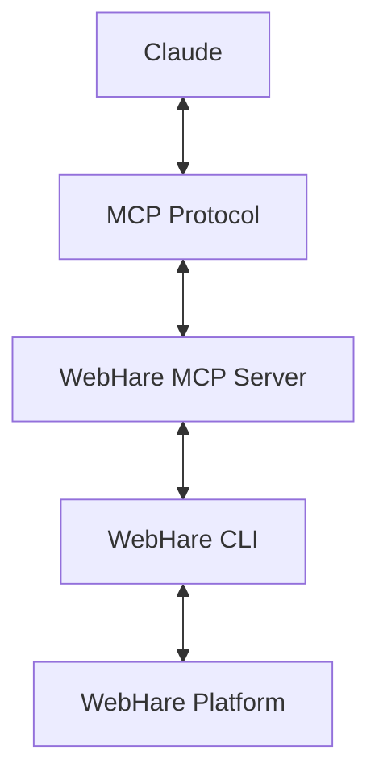
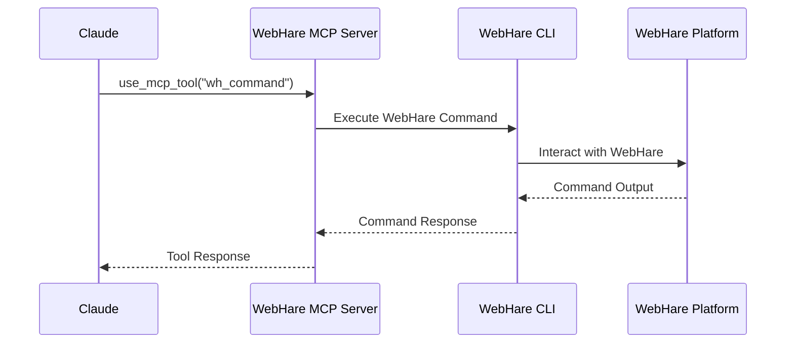
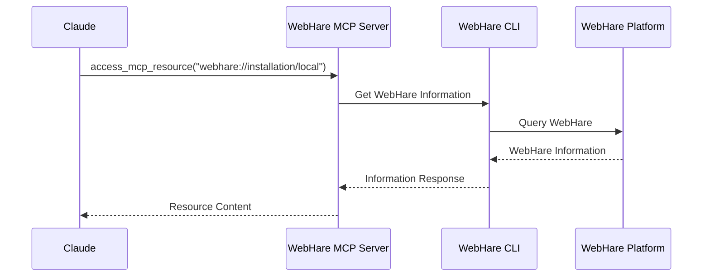

# WebHare MCP Server System Patterns

## System Architecture

The WebHare MCP Server follows a modular architecture that separates concerns and provides a clean interface for interacting with the WebHare platform through the WebHare CLI.



### Key Components

1. **MCP Server Core**
   - Handles MCP protocol communication
   - Manages request/response lifecycle
   - Provides error handling and logging

2. **Tool Handlers**
   - Implement specific tool functionality
   - Process tool arguments
   - Execute commands and return results

3. **Resource Handlers**
   - Expose WebHare installation as a resource
   - Provide WebHare information
   - Format resource data for consumption

4. **Command Execution Layer**
   - Executes shell commands
   - Manages WebHare CLI interactions
   - Handles command output and errors

## Design Patterns

### Command Pattern

The server uses the Command pattern to encapsulate requests as objects, allowing for parameterization of clients with different requests and queue or log requests.

```typescript
// Example of Command pattern in the tool handlers
server.setRequestHandler(CallToolRequestSchema, async (request) => {
  switch (request.params.name) {
    case "wh_status": {
      // Command implementation
    }
    case "wh_command": {
      // Command implementation
    }
    // Other commands...
  }
});
```

### Adapter Pattern

The server acts as an adapter between the MCP protocol and the WebHare CLI, converting MCP requests into CLI commands and CLI responses into MCP responses.

```typescript
// Example of Adapter pattern for WebHare CLI
async function executeWebHareCommand(command: string, args: string[] = []): Promise<string> {
  // Convert MCP request to WebHare CLI command
  const fullCommand = `${WEBHARE_CLI_PATH} ${command} ${args.map(arg => `"${arg.replace(/"/g, '\\"')}"`).join(' ')}`;
  
  // Execute the command
  const { stdout, stderr } = await executeCommand(fullCommand);
  
  // Convert CLI output to MCP response
  return stdout.trim();
}
```

### Factory Pattern

The server uses a factory-like approach to create resources and tool responses based on the request type.

```typescript
// Example of Factory pattern for resources
server.setRequestHandler(ListResourcesRequestSchema, async () => {
  // Check if WebHare is installed
  const { installed } = await checkWebHareStatus();
  
  if (!installed) {
    return {
      resources: []
    };
  }
  
  return {
    resources: [
      {
        uri: `webhare://installation/local`,
        mimeType: "application/json",
        name: `WebHare Local Installation`,
        description: `Information about the local WebHare installation`
      }
    ]
  };
});
```

### Strategy Pattern

The server uses different strategies for checking WebHare status and executing commands.

```typescript
// Strategy for checking WebHare status
async function checkWebHareStatus(): Promise<{ installed: boolean; running: boolean }> {
  try {
    // Check if WebHare CLI exists
    const installed = existsSync(WEBHARE_CLI_PATH);
    
    if (!installed) {
      return { installed, running: false };
    }
    
    // Check if WebHare is running
    try {
      const output = await executeWebHareCommand("isrunning");
      return { installed, running: true };
    } catch (error) {
      return { installed, running: false };
    }
  } catch (error) {
    return { installed: false, running: false };
  }
}

// Strategy for executing commands
async function executeCommand(command: string): Promise<{ stdout: string; stderr: string }> {
  try {
    return await execAsync(command);
  } catch (error: any) {
    throw new McpError(
      ErrorCode.InternalError,
      `Command execution failed: ${error.message}`
    );
  }
}
```

## Component Relationships

### MCP Server and WebHare CLI

The MCP server interacts with the WebHare CLI through shell commands, executing WebHare commands and processing the results.



### MCP Server and WebHare Resources

The MCP server exposes WebHare installation information as a resource that can be accessed by Claude.



## Error Handling

The server implements a consistent error handling pattern:

1. **Try-Catch Blocks**
   - Wrap command execution in try-catch
   - Catch specific error types
   - Convert to MCP errors with appropriate codes

2. **Error Propagation**
   - Propagate errors up the call stack
   - Add context at each level
   - Return structured error responses

3. **Error Logging**
   - Log errors to console
   - Include error details
   - Provide context for debugging

```typescript
// Example of error handling pattern
try {
  // Execute command
} catch (error: any) {
  throw new McpError(
    ErrorCode.InternalError,
    `Command execution failed: ${error.message}`
  );
}
```

## Configuration Management

The server uses environment variables for configuration, with sensible defaults:

```typescript
// Example of configuration management
const WEBHARE_CLI_PATH = process.env.WEBHARE_CLI_PATH || join(homedir(), "projects/webhare/whtree/bin/wh");
```

This variable can be set in the MCP settings file to customize the server behavior.

## Startup Process

The server follows a structured startup process:

1. **Initialize Server**
   - Create MCP server instance
   - Configure capabilities
   - Set up request handlers

2. **Connect to Transport**
   - Connect to stdio transport
   - Start listening for requests

3. **Log Configuration**
   - Log WebHare CLI path
   - Check and log WebHare status

```typescript
async function main() {
  const transport = new StdioServerTransport();
  await server.connect(transport);
  console.error("WebHare MCP server running on stdio");
  
  // Log WebHare CLI path
  console.error(`Using WebHare CLI at: ${WEBHARE_CLI_PATH}`);
  
  // Check WebHare status on startup
  try {
    const status = await checkWebHareStatus();
    console.error(`WebHare status: ${JSON.stringify(status)}`);
  } catch (error) {
    console.error(`Failed to check WebHare status: ${error}`);
  }
}
```

## Resource Management

The server manages WebHare resources through a structured approach:

1. **Resource Identification**
   - Use URI scheme for resource identification
   - Implement resource handlers for different resource types

2. **Resource Retrieval**
   - Execute WebHare commands to get resource information
   - Format resource data as JSON
   - Return resource content with appropriate MIME type

3. **Resource Caching**
   - Currently no caching implemented
   - Future enhancement to improve performance
